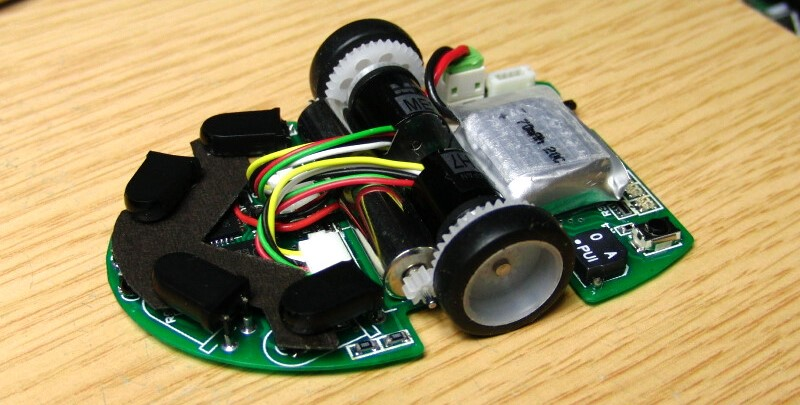
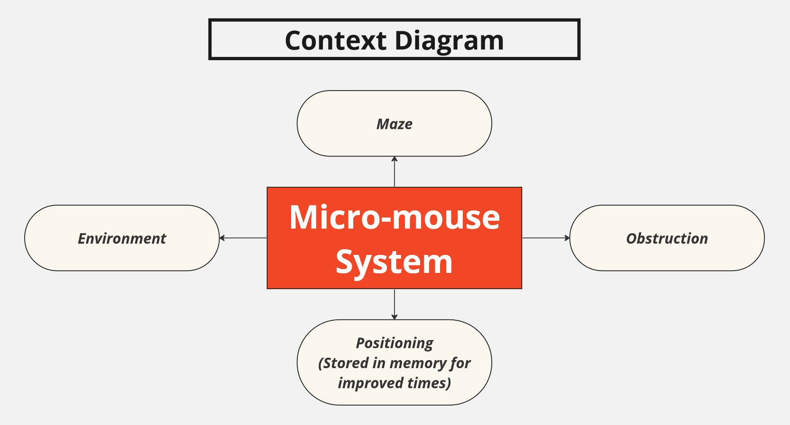

# Micro-Mouse Project

This repository focuses on the development of a micro-mouse, a robotic device designed to autonomously solve mazes. Our micro-mouse integrates advanced sensing and power subsystems to navigate through mazes effectively, leveraging a high-performance STM32L476 processor for enhanced processing power and connectivity.

This project aims to build a micro-mouse that can learn and adapt its route through a maze with each attempt, powered by a self-sustaining power supply. This repo details a system designed, tested, documented, and implemented by our team.

## System Overview

### Key Features

- **Sensing Subsystem:** Capable of detecting obstructions within the maze environment.
- **Power Subsystem:** Designed to provide consistent energy to the sensors and motors.
- **Compatibility:** Ensures seamless integration with existing hardware components.

### Limitations

- **Budget Constraints:** Necessitate cost-effective solutions in both design and material selection.
- **Size Constraints:** Modules must fit within the micro-mouse's design specifications without physical alterations.
- **Scope:** Primarily focused on hardware design, with minimal software components addressed.

### Environment and Interaction

The diagram below illustrates the context diagram of the micro-mouse system, showcasing its interaction with the maze, environmental elements, and obstructions.

## Getting Started

### What You Will Need

- **STM32L476 Discovery Board**
- **Appropriate Sensors:** For detecting obstacles and maze walls.
- **Battery and Charging Module:** To ensure a self-sustaining power supply.
- **PCB Components:** For connecting sensors and power systems to the motherboard.
- **STM32CubeIDE:** For programming and debugging.
- **Jumper Cables**
- **MicroUSB to USB Connector**

## Contributing

We welcome contributions from the community. If you have improvements or bug fixes, please fork the repository and submit a pull request.

## License

This project is licensed under the MIT License - see the LICENSE.md file for details.

---

For more detailed information about the design, integration, and testing of the micro-mouse system, refer to our final design report available in this repository.
